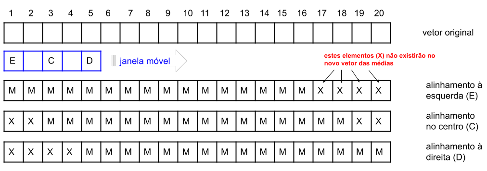
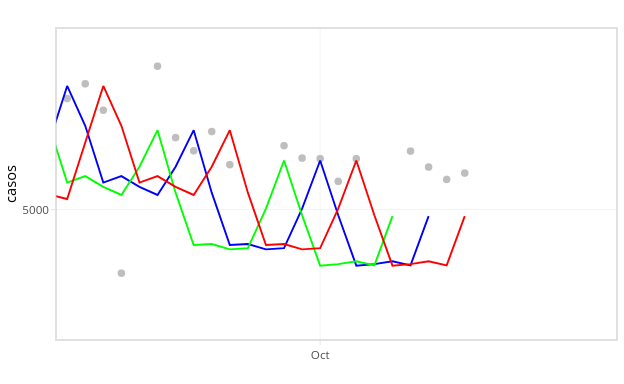
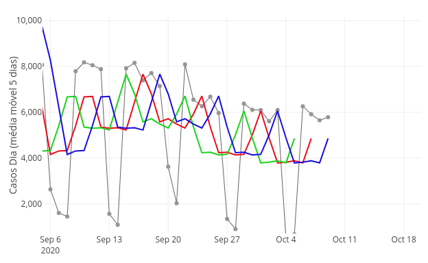

```{css, echo=FALSE}
.main-container {
    max-width: 600px !important;
}

pre {
  max-height: 800px !important;
  overflow-y: auto !important;
  overflow-x: scroll !important;
}
pre code {
  white-space: pre
}
```

```{r setup, include=FALSE}
knitr::opts_chunk$set(echo = TRUE, message = FALSE, warning = FALSE, tidy = TRUE, R.options = list(width = 60))
```

# Médias Móveis

Médias móveis são um recurso muito utilizado em dados do tipo *séries temporais*; sua aplicação é para _suavizar_ uma série, permitindo que sejam mais facilmente observados comportamentos e tendências nesses dados.

A ideia é que cada ponto original será subsituído pela média dos pontos vizinhos, definidos através de uma _janela_ de largura $w$, que vai se movimentando pelos pontos. 



Uma das escolhas possíveis ao se calcular uma média móvel é quem será o elemento de referência (alinhamento) da média. Na figura mostrada acima, temos 3 possíveis escolhas, ou alinhamentos, indicados:

- à esquerda (E);
- no centro (C); e
- à direita (D).

O impacto desta escolha será na localização dos elementos não presentes ($w-1$) no vetor resultante:

- no alinhamento à esquerda, os elementos faltantes estarão no final do vetor resultante, indicados por **X** na figura;
- no alinhamento central, teremos $\frac{w-1}{2}$ elementos faltantes de cada lado, onde $w$ é a largura da janela -- normalmente, um número ímpar;
- no alinhamento à direita, os elementos faltantes estarão no início do vetor resultante.

Na figura abaixo temos uma ilustração da média móvel com alinhamento à esquerda em uma janela de 5 elementos; note como os 4 últimos elementos finais estarão faltando (`NA`).


# Fazendo no **R**

### Vetor mostrado na figura acima

```{r}
vt <- c(5,7,6,4,7,9,12,8,14,17,23,31,27,29,35,45,32,29,55,49)
```

Para fazer a média móvel, vou usar a função `frollmean` do pacote [**data.table**](https://cran.r-project.org/web/packages/data.table/index.html). A síntaxe (simplificada) desta função é:

- `frollmean(x, n = w, align = "left|center|right")`
    * `x` é o elemento (vetor) para o qual vamos calcular a média móvel;
    * `n` é a largura da janela, o nosso $w$ na fórmula mostrada anteriormente;
    * `align` é o alinhamento, um de "left", "center" ou "right".

```{r echo = FALSE}
library(data.table)
```

**Alinhamento à esquerda**

```{r}
frollmean(vt, n = 5, align = "left")
```

**Alinhamento central**

```{r}
frollmean(vt, n = 5, align = "center")
```

**Alinhamento à direita**

```{r}
frollmean(vt, n = 5, align = "right")
```

### Dados em um `data.frame`

Vamos agora calcular as médias móveis de uma variável em um `data.frame`; vou utilizar um _dataset_ resultante dos casos de Covid-19 no Estado de São Paulo, de 25/Fevereiro/2020 a 09/Outubro/2020, ou seja, 228 dias. Estes dados foram originalmente baixados (em 04/Nov/2020) do projeto [Brasil.io](https://brasil.io/)

#### Leitura dos dados
```{r }
library(readr)
casos_SP <- read_csv("data/dataset.csv", 
    col_types = cols(date = col_date(format = "%Y-%m-%d"), 
        casos = col_integer()))
```

#### Pequena inspeção da estrutura do arquivo

```{r}
str(casos_SP)
```

#### Início e Final

```{r}
head(casos_SP)
```


```{r}
tail(casos_SP)
```


### Calculando Média Móvel

Para usar as funcionalidades do `data.table` precisamos transformar nosso `data.frame` em um tipo `data.table`.

```{r}
setDT(casos_SP)
```

```{r}
casos_SP[, ma5esq := frollmean(casos, n = 5, align = "left")] # alinhamento à esquerda
casos_SP[, ma5center := frollmean(casos, n = 5, align = "center")] # alinhamento central
casos_SP[, ma5dir := frollmean(casos, n = 5, align = "right")] # alinhamento à direita
```

Veja como os `NAs` aparecem no `data.frame`:

```{r}
casos_SP
```

### Visualizando os dados

Vamos usar duas bibliotecas para esta visualização; o gráfico final em ambas será um `plot.ly`, mas construído de formas diferentes. As bibliotecas são `ggplot2` e `plotly`


```{r}
library(ggplot2)
library(plotly)
```

```{r}
# função auxiliar para formatar os números
numero_int <- scales::label_comma(accuracy = 1, big.mark = ".", decimal.mark = ",")
```


#### `ggplotly`

```{r}
g <- ggplot(casos_SP) + geom_point(aes(x= date, y = casos), color = "gray") + 
  geom_line(aes(x = date, y = ma5center), color = "blue") +
  geom_line(aes(x = date, y = ma5esq), color = "green") +
  geom_line(aes(x = date, y = ma5dir), color = "red") +
  labs(x = "") +
  theme_light()
ggplotly(g)
```

Um _zoom_ na parte final do gráfico mostrando as médias móveis.




#### `plot.ly`

```{r preview=TRUE}
p <- plot_ly(casos_SP, hoverinfo = 'text', 
               text  = ~paste('<br>Data:', date,
                             '<br>Casos Dia:', numero_int(casos),
                             '<br>MA 5cent:', numero_int(ma5center),
                             '<br>MA 5esq:', numero_int(ma5esq),
                             '<br>MA 5dir:', numero_int(ma5dir)),  
               showlegend = FALSE, colorscale = "Jet")
p <- p %>% add_trace(x = casos_SP$date, y = casos_SP$casos, type = "scatter", 
              mode = "lines+markers", line = list(color = 'rgb(100, 100, 100)', 
              width = 1), marker = list(color = 'rgb(150,150,150, .5)'), name = "Casos")
p <- p %>% add_trace(x = casos_SP$date, y = casos_SP$ma5center, type = "scatter", 
              mode = "lines", line = list(color = 'rgb(235,12,24)', width = 2), 
              name = "MA 5cent") %>% 
  add_trace(x = casos_SP$date, y = casos_SP$ma5esq, type = "scatter", mode = "lines", 
            line = list(color = 'rgb(23,212,24)', width = 2), name = "MA 5esq") %>% 
  add_trace(x = casos_SP$date, y = casos_SP$ma5dir, type = "scatter", mode = "lines", 
            line = list(color = 'rgb(23,12,224)', width = 2), name = "MA 5dir") 
yax <- list(title = "Casos Dia (média móvel 5 dias)",
            separatethousands = TRUE,
            exponentformat = "none"
           )
p <- layout(p, yaxis = yax)
p
```

Um _zoom_ na parte final do gráfico mostrando as médias móveis.




Veja como as médias móveis aparecem deslocadas nos gráficos; entretanto, como são calculadas com os mesmos números (mesma janela), são exatamente iguais. 

_That's all folks!_


